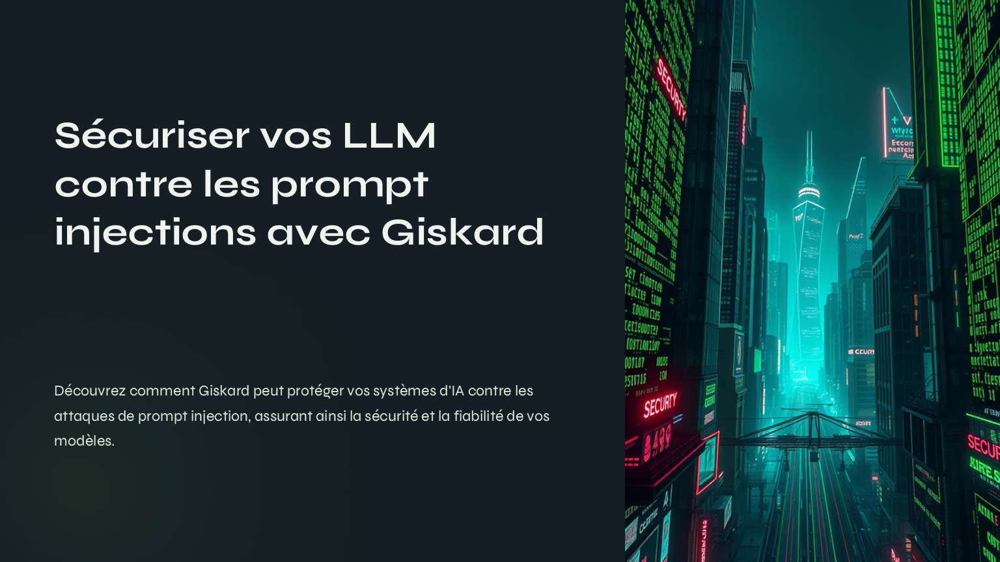

  <h1>🧠 Prompt Injection & Giskard 🐢</h1>
  

## 🇬🇧 English Version

### Overview

This repository contains the course project on prompt injection attacks and LLM (Large Language Model) security, created in collaboration with a classmate. The presentation explains how the open-source tool **Giskard** 🐢 can be used to detect and prevent prompt injection vulnerabilities in AI systems.

### 📄 Presentation

> 🔗 [Download the presentation (PPTX)](./presentation/Securiser-vos-LLM-contre-les-prompt-injections-avec-Giskard.pptx)

> 🔗 [Download the presentation (PDF)](./presentation/Securiser-vos-LLM-contre-les-prompt-injections-avec-Giskard.pdf)

### Technologies & Skills

- Prompt Injection Attacks
- LLM Security & Ethics
- Giskard 🐢 (open-source testing framework)

---

## 🇫🇷 Version Française

### Présentation

Ce dépôt contient un projet de cours réalisé avec un camarade sur les attaques par **prompt injection** et la sécurité des modèles de langage (LLM). La présentation met en lumière comment l’outil open source **Giskard** 🐢 permet d’identifier et de prévenir ces vulnérabilités.

### 📄 Présentation

> 🔗 [Télécharger la présentation (PPTX)](./presentation/Securiser-vos-LLM-contre-les-prompt-injections-avec-Giskard.pptx)

> 🔗 [Télécharger la présentation (PDF)](./presentation/Securiser-vos-LLM-contre-les-prompt-injections-avec-Giskard.pdf)

### Technologies & Compétences

- Attaques par Prompt Injection
- Sécurité & Éthique des LLM
- Giskard 🐢 (framework open source de tests)
